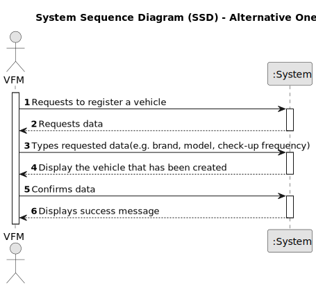

# US006 - As an FM, I wish to register a vehicle including Brand, Model, Type, Tare, Gross Weight, Current Km, Register Date, Acquisition Date, Maintenance/Check-up Frequency (in Kms)

## 1. Requirements Engineering

### 1.1. User Story Description

As a Vehicle and Equipment Fleet Manager (VFM) I want to register a vehicle.

### 1.2. Customer Specifications and Clarifications 

**From the specifications document:**

> "This type of vehicle can be passenger only or mixed,
light or heavy, vans or trucks with open or closed boxes.
As for machines, MS has tractors, backhoe loaders and rotating machines, lawn mowers,
between others. The equipment can be very diverse, such as sprayers, elevators
platforms, chainsaws, brush cutters, blowers, ladders, cisterns and the various elements
that can be attached to tractors, such as disc harrows, weeders, aerators and scarifiers."

**From the client clarifications:**

> **Question:**"Can a FM register no vehicles or does he have to regsiter at least one?"
>
> **Answer:**"The VFM is a role or system user profile that has the rights to perform some system actions (like the ones described by the US06, US07 and US08). In theory If there is no need to registering a vehicle, no vehicles will be registered but that would be rather odd." 

### 1.3. Acceptance Criteria

* **AC1:** The system should allow the VFM to register a vehicle.
* **AC2:** The system should provide a form for the Vehicle and Equipment Fleet Manager to input details of a new vehicle, including Brand, Model, Type, Tare, Gross Weight, Current Km, Register Date, Acquisition Date, Maintenance/Check-up Frequency (in Kms), and a description.
* **AC3:** Once the vehicle registration is successful the system should store the vehicle details.

### 1.4. Found out Dependencies

*  US8 does not depend on any other.

### 1.5 Input and Output Data

**Input Data:**

* Typed data:
    * Brand
    * Model
    * Type
    * Tare Weight
    * Gross Weight
    * Current Km
    * Register Date
    * Acquisition Date
    * Check-up Frequency

* Selected data:
    * None

**Output Data:**

* Success/Failure status of the vehicle registration operation
* Confirmation of the operation

### 1.6. System Sequence Diagram (SSD)

**_Other alternatives might exist._**

### 1.7 Other Relevant Remarks
