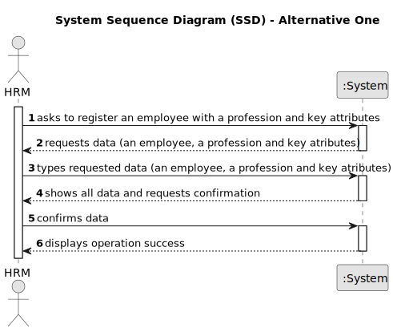

# US003 - As an HRM, I want to register a collaborator with a job and fundamental characteristics

## 1. Requirements Engineering

### 1.1. User Story Description

The user story involves the task of adding a new employee to the system, capturing essential details such as personal information, job role, and any other pertinent attributes necessary for their registration.

### 1.2. Customer Specifications and Clarifications 

**From the specifications document:**

>	"MS has a wide range of employees who carry out the most varied tasks in the context of green space management. Some examples of professions are: planner, estimator, gardener, electrician or bricklayer. Thus, an employee has a main occupation (profession) and a set of skills that enable them to perform/take on certain tasks/responsibilities, for example: driving different types of vehicles (e.g. light, heavy), operating machinery such as backhoes or tractors; pruning trees; applying phytopharmaceuticals." 

**From the client clarifications:**

> **Question:** What should be the accepted format for the emails? Should only specific email services be accepted?
>
> **Answer:** A valid email address consists of an email prefix and an email domain, both in acceptable formats.
The prefix appears to the left of the @ symbol. The domain appears to the right of the @ symbol.

### 1.3. Acceptance Criteria

* **AC1:** Name, birthdate, admission date, address, contact info (mobile and email), ID doc type and respective number should be provided by HRM.
* **AC2:** Registering a collaborator must include a job and a set of skills.

### 1.4. Found out Dependencies

* There is a dependency on US003 as US001 and US002 must be functional in order to perform what this US is asking.

### 1.5 Input and Output Data

**Input Data:**

* Typed data:
    * a name, birthdate, admission date, address, contact info (mobile and email), ID doc type and respective number
    * a profession 
    * an attribute
  
**Output Data:**

* List of information inserted
* Confirmation of the operation
* (In)Success of the operation

### 1.6. System Sequence Diagram (SSD)

**_Other alternatives might exist._**

#### Alternative One

### 1.7 Other Relevant Remarks
