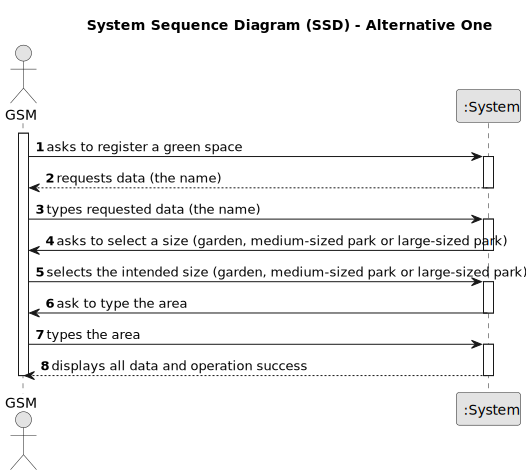

# US020 - As a Green Space Manager (GSM), I want to register a green space.

## 1. Requirements Engineering

### 1.1. User Story Description

As a Green Space Manager (GSM), I want to register a green
space (garden, medium-sized park or large-sized park) and its respective
area.

### 1.2. Customer Specifications and Clarifications

**From the client clarifications:**

> **Question:** 
>
> **Answer:** 

### 1.3. Acceptance Criteria

* **AC1:** The name, the size (garden, medium-sized park or large-sized park) and area.
* **AC2:** The green space cannot be already registred.

### 1.4. Found out Dependencies

* There is no dependency.

### 1.5 Input and Output Data

**Input Data:**

* Typed data:
    * name
    * area

* Selected data:
  * size
  
**Output Data:**

  * List of information inserted
  * (In)Success of the operation

### 1.6. System Sequence Diagram (SSD) 

**_Other alternatives might exist._**

#### Alternative One

### 1.7 Other Relevant Remarks

* n/a