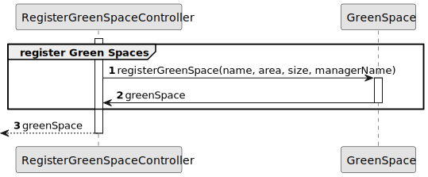

# US020 - As a Green Space Manager (GSM), I want to register a green space.

## 3. Design - User Story Realization 

### 3.1. Rationale

_**Note that SSD - Alternative One is adopted.**_

| Interaction ID                                                                    | Question: Which class is responsible for...      | Answer                         | Justification (with patterns)              |
|:----------------------------------------------------------------------------------|:-------------------------------------------------|:-------------------------------|:-------------------------------------------|
| Step 1: asks to register a green space                                            | ... asking to register a green space?            | RegisterGreenSpaceUI           | IE - is responsible for user interactions. |
|                                                                                   | 	... coordinating the US?                        | RegisterCollaboratorController | Controller                                 |
|                                                                                   | 	... instantiating a new Green Space?           | RegisterGreenSpaceUI           | Creator (Rule 1): in the DM Green Space.   |
| Step 2: requests data (manager's name)                                            | ... requesting data (manager's name)?            | RegisterGreenSpaceUI           | IE - is responsible for user interactions. |
| Step 3: types requested data (manager's name)                                     | ... receiving the typed data (manager's name)?   | RegisterGreenSpaceUI           | IE - is responsible for user interactions. |
| Step 4: requests data (Green Space name)                                          | ... requesting data (Green Space name)?          | RegisterGreenSpaceUI           | IE - is responsible for user interactions. |
| Step 5: types requested data (Green Space name)                                   | ... receiving the typed data (Green Space name)? | RegisterGreenSpaceUI           | IE - is responsible for user interactions. |
|                                                                                   | 	... getting the size?                           | RegisterCollaboratorController | Controller, gets the class Size            |
| Step 6: asks to select a size (garden, medium-sized park or large-sized park)     | ... asking to select a size (garden, medium-sized park or large-sized park)? | RegisterGreenSpaceUI           |     IE - is responsible for user interactions.                                       |
| Step 7: selects the intended size (garden, medium-sized park or large-sized park) | ... receiving the selected size (garden, medium-sized park or large-sized park)? | RegisterGreenSpaceUI           |    IE - is responsible for user interactions.                                        |
| Step 8: ask to type the area                                                      | ... asking to type the area? | RegisterGreenSpaceUI           |                              IE - is responsible for user interactions.              |
| Step 9: types the area                                                            | ... receiving the typed area? | RegisterGreenSpaceUI           |                          IE - is responsible for user interactions.                  |
|                                                                                   | 	... instantiating a new Green Space?           | RegisterGreenSpaceUI           | Creator (Rule 1): in the DM Green Space.   |
|                                                                                   | ... saving the typed data? | GreenSpace                     | IE - object created in step 9 has its own data. |
| Step 10: displays all data and operation success                                  | ... displaying all data and operation success? | Vehicle                        |                IE - is responsible for user interactions.          |

### Systematization ##

According to the taken rationale, the conceptual classes promoted to software classes are: 

* Green_Spaces promoted to GreenSpace

Other software classes (i.e. Pure Fabrication) identified: 

* RegisterGreenSpaceUI  
* RegisterGreenSpaceController

## 3.2. Sequence Diagram (SD)

_**Note that SSD - Alternative One is adopted.**_

### Full Diagram

This diagram shows the full sequence of interactions between the classes involved in the realization of this user story.

### Split Diagrams

The following diagram shows the same sequence of interactions between the classes involved in the realization of this user story, but it is split in partial diagrams to better illustrate the interactions between the classes.

It uses Interaction Occurrence (a.k.a. Interaction Use).

**Register Green Space**

## 3.3. Class Diagram (CD)

