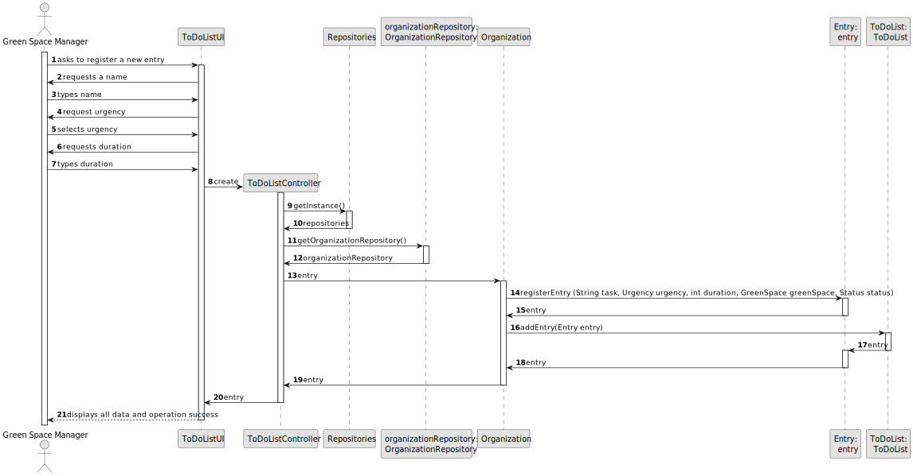
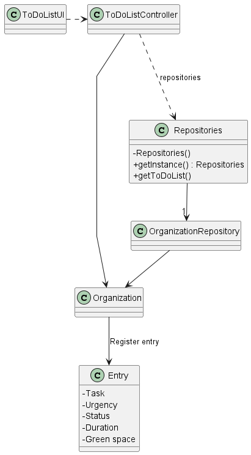

# US021 - As a GSM, I want to add a new entry to the To-Do List.

## 3. Design - User Story Realization 

### 3.1. Rationale

_**Note that SSD - Alternative One is adopted.**_

| Interaction ID                                        | Question: Which class is responsible for... | Answer                  | Justification (with patterns)                                                 |
|:------------------------------------------------------|:--------------------------------------------|:------------------------|:------------------------------------------------------------------------------|
| Step 1: asks to add a new entry to the To-Do List     | ... interacting with the actor?             | ToDoListUI              | IE - is responsible for user interactions.                                    |
|                                                       | ... coordinating the US?                    | ToDoListController      | Controller                                                                    |
| Step 2: asks to select the green space                | ... interacting with the actor?             | VehicleNeedingCheckUpUI | IE - is responsible for user interactions.                                    |
| Step 3: selects the intended green space              | ... interacting with the actor?             | VehicleNeedingCheckUpUI | IE - is responsible for user interactions.                                    |
| Step 4: asks to type the description of the new entry | ... interacting with the actor?             | VehicleNeedingCheckUpUI | IE - is responsible for user interactions.                                    |
| Step 5: types the description                         | ... interacting with the actor?             | VehicleNeedingCheckUpUI | IE - is responsible for user interactions.                                    |
|                                                       | ... creating the object?                    | Entry                   | Information Expert: The Entry class is responsible for managing its own data. |
|                                                       | ... saving the information?                 | ToDoList                | Pure Fabrication                                                              |
| Step 6: displays all data and operation success       | ... interacting with the actor?             | VehicleNeedingCheckUpUI | IE - is responsible for user interactions.                                    |

### Systematization ##

According to the taken rationale, the conceptual classes promoted to software classes are: 

* ToDoList promoted to ToDoList
* Entry promoted to Entry

Other software classes (i.e. Pure Fabrication) identified: 

* ToDoListUI  
* ToDoListController

## 3.2. Sequence Diagram (SD)

_**Note that SSD - Alternative Two is adopted.**_

### Full Diagram

This diagram shows the full sequence of interactions between the classes involved in the realization of this user story.

## 3.3. Class Diagram (CD)

