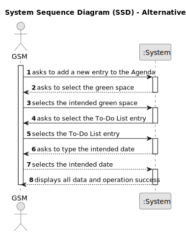

# US022 - As a GSM, I want to add a new entry in the Agenda.

## 1. Requirements Engineering

### 1.1. User Story Description

As a Green Space Manager I have the need to keep track of the things that need to be done, I want to be able to add a new entry to the Agenda every time I want to register something there.

### 1.2. Customer Specifications and Clarifications

**From the client clarifications:**

> **Question:** 
>
> **Answer:** 

### 1.3. Acceptance Criteria

* **AC1:** The new entry must be associated with a green space managed by the GSM.
* **AC2:** The new entry must exist in the To-Do list.

### 1.4. Found out Dependencies

* There is a dependency on "US020 - Green Space Registration" and on "US021- New entry on the To-Do List"

### 1.5 Input and Output Data

**Input Data:**
* Typed data:
  * date (?)

* Selected data:
  * green space
  * To-Do List entry
  
**Output Data:**

  * New entry
  * (In)Success of the operation

### 1.6. System Sequence Diagram (SSD) 

**_Other alternatives might exist._**

#### Alternative One

### 1.7 Other Relevant Remarks

* n/a