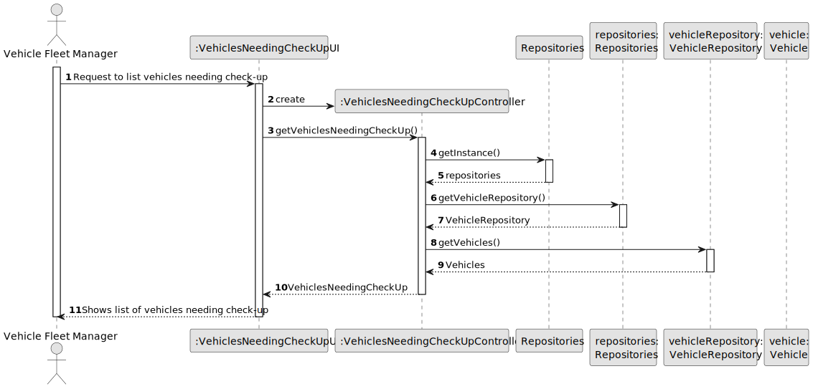
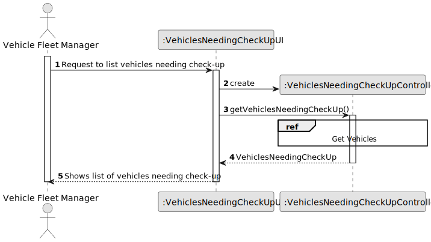

# US008 - As an FM, I want to list the vehicles needing the check-up

## 3. Design - User Story Realization 

### 3.1. Rationale

_**Note that SSD - Alternative One is adopted.**_

| Interaction ID                                  | Question: Which class is responsible for...                | Answer                  | Justification (with patterns)               |
|:------------------------------------------------|:-----------------------------------------------------------|:------------------------|:--------------------------------------------|
| Step 1: asks to add a new entry to the Agenda   | ... interacting with the actor?                            | AgendaUI                | Information Expert: The UI is responsible for user interactions.  |
|                                                 | ... coordinating the US?                                   | AgendaController        | Controller: The controller is responsible for handling the user story. |
| Step 2: asks to select the To-Do List entry     | ... generating the list of vehicles in need of a check-up? | AgendaUI                | Information Expert: The UI is responsible for user interactions. |
|                                                 | ... getting the list of entries?                           | AgendaController        | Information Expert: The controller is responsible for retrieving the list of entries. |
| Step 3: selects the To-Do List entry            | ... interacting with the actor?                            | AgendaUI                | Information Expert: The UI is responsible for user interactions.  |
| Step 4: asks to type the intended date          | ... interacting with the actor?                            | AgendaUI                | Information Expert: The UI is responsible for user interactions.  |
| Step 5: selects the intended date               | ... interacting with the actor?                            | AgendaUI                | Information Expert: The UI is responsible for user interactions.  |
|                                                 | ... changing the date from null to a day?                  | Entry                   | Information Expert: The Entry class is responsible for managing its own data. |
|                                                 | ... changing the status of the entry?                      | Entry                   | Information Expert: The Entry class is responsible for managing its own data. |
| Step 6: displays all data and operation success | ... interacting with the actor?                            | AgendaUI | Information Expert: The UI is responsible for user interactions.  |

### Systematization ##

According to the taken rationale, the conceptual classes promoted to software classes are: 

* Vehicles_Machines_Equipment promoted to Vehicle

Other software classes (i.e. Pure Fabrication) identified: 

* VehicleNeedingCheckUpUI  
* VehicleNeedingCheckUpController

## 3.2. Sequence Diagram (SD)

_**Note that SSD - Alternative Two is adopted.**_

### Full Diagram

This diagram shows the full sequence of interactions between the classes involved in the realization of this user story.

### Split Diagrams

The following diagram shows the same sequence of interactions between the classes involved in the realization of this user story, but it is split in partial diagrams to better illustrate the interactions between the classes.

It uses Interaction Occurrence (a.k.a. Interaction Use).

**Get Vehicles**

## 3.3. Class Diagram (CD)

