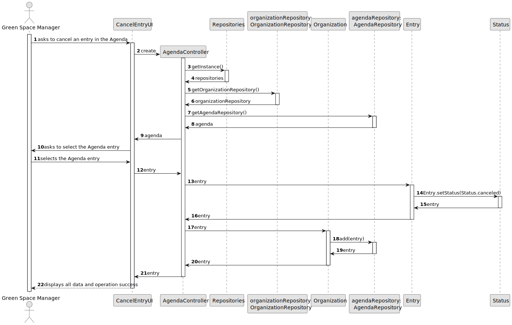
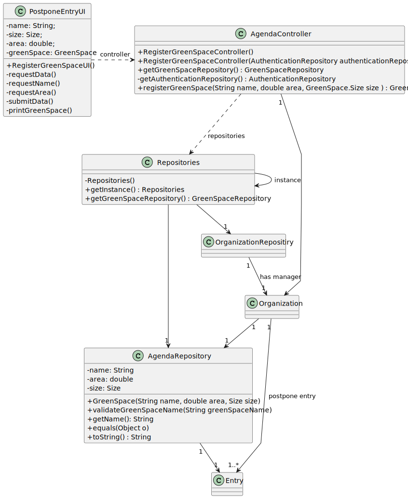

# US025 - As a GSM, I want to Cancel an entry in the Agenda.

## 3. Design - User Story Realization 

### 3.1. Rationale

_**Note that SSD - Alternative One is adopted.**_

| Interaction ID                                              | Question: Which class is responsible for...                | Answer           | Justification (with patterns)                                                      |
|:------------------------------------------------------------|:-----------------------------------------------------------|:-----------------|:-----------------------------------------------------------------------------------|
| Step 1: Asks to cancel an entry from the Agenda             | ... interacting with the actor?                            | CancelEntryUI    | IE - is responsible for user interactions.                                         |
|                                                             | ... coordinating the US?                                   | AgendaController | Controller: The controller is responsible for handling the user story.             |
|                                                             | ... getting the list of entries?                           | AgendaController | Controller: The controller is responsible for handling the user story.             |
| Step 2: Retrieve list of entries and requests to choose one | ... interacting with the actor?                            | CancelEntryUI    | IE - is responsible for user interactions.                                         |
| Step 3: Chooses one of the entries                          | ... interacting with the actor?                            | CancelEntryUI    | IE - is responsible for user interactions.                                         |
|                                                             | ... changing the status?                                   | Entry            | Information Expert: The Entry class is responsible for managing its own data.      |
| Step 4: Displays operation success                          | ... interacting with the actor?                            | CancelEntryUI    | IE - is responsible for user interactions.                                         |

### Systematization ##

According to the taken rationale, the conceptual classes promoted to software classes are: 

* Entry promoted to Entry

Other software classes (i.e. Pure Fabrication) identified: 

* CancelEntryUI  
* AgendaController

## 3.2. Sequence Diagram (SD)

_**Note that SSD - Alternative Two is adopted.**_

### Full Diagram

This diagram shows the full sequence of interactions between the classes involved in the realization of this user story.

## 3.3. Class Diagram (CD)

