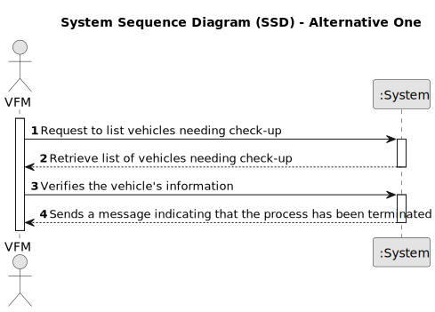

# US023 - As a GSM, I want to assign a Team to an entry in the Agenda.

## 1. Requirements Engineering

### 1.1. User Story Description
As a Green Space Manager (GSM), I want to have the ability to assign a specific team to an 
entry in the agenda so that the responsibilities for that entry are clearly defined and managed by 
the appropriate team.

### 1.2. Customer Specifications and Clarifications

**From the client clarifications:**

> **Question:** -
### 1.3. Acceptance Criteria

* **AC1:** A message must be sent to all team members informing
  them about the assignment.
* **AC2:** Different email services can send the message. These services must be defined through a configuration file to allow the use
  of different platforms (e.g. Gmail, DEI’s email service, etc.).

### 1.4. Found out Dependencies

* There is a dependency on "US21 - As a GSM, I want to add a new entry to the To-Do List."
* There is also a dependency on "US22 - As a GSM, I want to add a new entry in the Agenda."

### 1.5 Input and Output Data

**Input Data:**

* Selected data:
  * Entry
  * Teams
  
**Output Data:**
  * (In)Success of the operation

### 1.6. System Sequence Diagram (SSD) 

![]

#### Alternative One

### 1.7 Other Relevant Remarks

* On the assignment the check-up list isn't mentioned, so I skipped the "from the specification document" point.