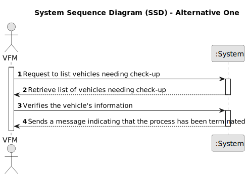

# US025 - As a GSM, I want to Cancel an entry in the Agenda.

## 1. Requirements Engineering

### 1.1. User Story Description

As a Green Space Manager, responsible for managing the green spaces in charge of the organization, I want to cancel an entry in the Agenda previously registered.

### 1.2. Customer Specifications and Clarifications

**From the client clarifications:**

> **Question:** 
> 
> **Answer:** 

### 1.3. Acceptance Criteria

* **AC1:** A canceled task should not be deleted but rather change its state.
* **AC2:** Only a GSM can do this.
* **AC3:** A task must be already created in order to cancel it.
* **AC4:** The system should only allow the GSM to cancel a task.
* **AC5:** The task mustn't have already been canceled.

### 1.4. Found out Dependencies

* There is a dependency on "US022 - As a GSM, I want to add a new entry in the Agenda." because we need to have an entry in order to cancel it.

### 1.5 Input and Output Data

**Input Data:**

* Typed data:
  * Tap a key to generate a list with the already registered entries in the Agenda.
  * Number of the desired entry.

* Selected data:
  * An entry from the Agenda.
  
**Output Data:**

  * List of entries from the Agenda.
  * The (in)success of the operation.

### 1.6. System Sequence Diagram (SSD) 

**_Other alternatives might exist._**

#### Alternative One

### 1.7 Other Relevant Remarks

* 