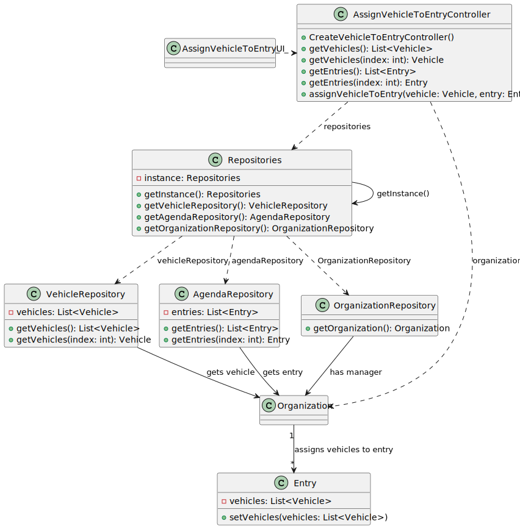

# US026 - As a Green Space Manager, I want to assign a vehicle to an entry

## 3. Design - User Story Realization

### 3.1. Rationale

| Interaction ID                                       | Question: Which class is responsible for...                | Answer                              | Justification (with patterns)               |
|:-----------------------------------------------------|:-----------------------------------------------------------|:------------------------------------|:--------------------------------------------|
| Step 1: Request to assign Vehicle to Entry           | ... interacting with the actor?                            | AssignVehicleToEntryUI              | IE - is responsible for user interactions.  |
|                                                      | ... coordinating the US?                                   | AssignVehicleToEntryController      | Controller                                  |
| Step 2: Retrieves list of Entries                    | ... generating the list of entries?                        | AgendaRepository                    | Information Expert                          |
| Step 3: Selects Entry                                | ... keeping the selected entry?                            | AssignVehicleToEntryUI              | IE - is responsible for user interactions.  |
| Step 4: Retrieves list of Vehicles                   | ... generating the list of vehicles?                       | VehicleRepository                   | Information Expert                          |
| Step 5: Selects Vehicle                              | ... keeping the selected vehicle?                          | AssignVehicleToEntryUI              | IE - is responsible for user interactions.  |
|                  | ... updating the entry with the assigned vehicle?          | Entry                               | Information Expert                          |
| Step 7: Displays message of (In)Success              | ... interacting with the actor?                            | AssignVehicleToEntryUI              | IE - is responsible for user interactions.  |

### Systematization ##

According to the taken rationale, the conceptual classes promoted to software classes are:

* Vehicle promoted to Vehicle
* Entry promoted to Entry
* Agenda promoted to AgendaRepository

Other software classes (i.e. Pure Fabrication) identified:

* AssignVehicleToEntryUI
* AssignVehicleToEntryController
* Repositories
* VehicleRepository
* Organization
* OrganizationRepository

## 3.2. Sequence Diagram (SD)

### Full Diagram

This diagram shows the full sequence of interactions between the classes involved in the realization of this user story.

## 3.3. Class Diagram (CD)

