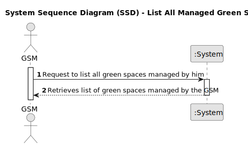

# US027 - As a GSM, I need to list all green spaces managed by me

## 1. Requirements Engineering

### 1.1. User Story Description

As a Green Space Manager, I am responsible for overseeing multiple green spaces. To efficiently manage my responsibilities, 
I need a comprehensive and easily accessible list of all the green spaces under my jurisdiction. 

### 1.2. Customer Specifications and Clarifications

### 1.3. Acceptance Criteria

* **AC1:** The System should allow the GSM to list all green spaces managed by him.
* **AC2:** The list of green spaces must be sorted by size in descending order. The sorting algorithm to be used by the application
must be defined through a configuration file. At least two sorting algorithms should be available.

### 1.4. Found out Dependencies

* There is a dependency on "US020 - As a Green Space Manager (GSM), I want to register a green
space (garden, medium-sized park or large-sized park) and its respective area." as there must be registered the green space.

### 1.5 Input and Output Data

**Input Data:**

* Typed data:
    * Tap a key to generate a list
  
* Selected Data:
  * Green Space

**Output Data:**

  * List of green spaces
  * List of all green spaces managed by the gsm
  * (In)Success of the operation

### 1.6. System Sequence Diagram (SSD) 

**_Other alternatives might exist._**

#### Alternative One

### 1.7 Other Relevant Remarks
