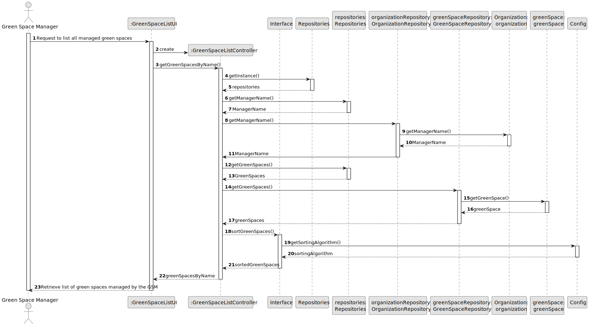
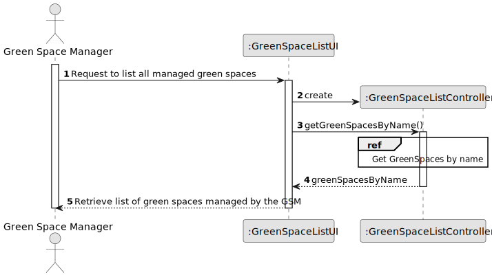
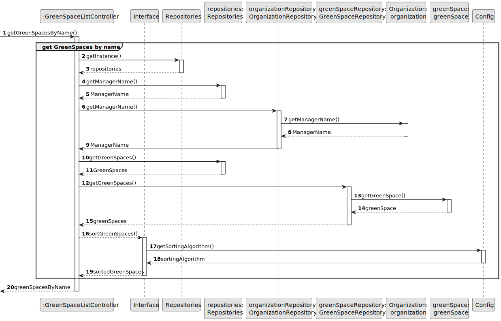
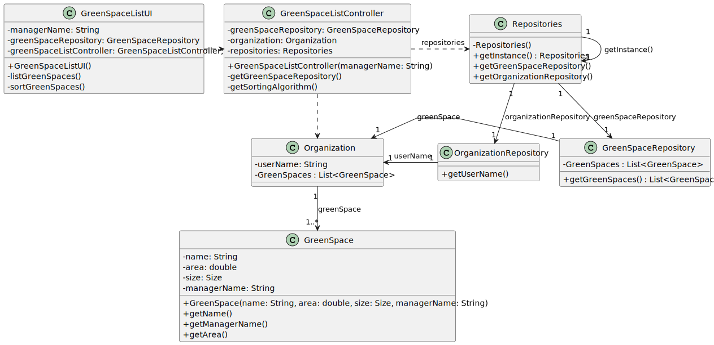

# US027 - As a GSM, I need to list all green spaces managed by me

## 3. Design - User Story Realization 

### 3.1. Rationale

_**Note that SSD - Alternative One is adopted.**_

| Interaction ID                                           | Question: Which class is responsible for...      | Answer                   | Justification (with patterns)              |
|:---------------------------------------------------------|:-------------------------------------------------|:-------------------------|:-------------------------------------------|
| Step 1: Request to list vehicles needing check-up        | ... interacting with the actor?                  | GreenSpaceListUI         | IE - is responsible for user interactions. |
|                                                          | ... coordinating the US?                         | GreenSpaceListController | Controller                                 |
| Step 2: Retrieve list of green spaces managed by the GSM | ... generating the list of managed green spaces? | Organization             | Information Expert                         |
|                                                          | ... providing Green Space information?           | GreenSpace               | Information Expert                         |
|                                                          | ... providing the list to the actor?             | GreenSpaceListUI         | IE - is responsible for user interactions. |

### Systematization ##

According to the taken rationale, the conceptual classes promoted to software classes are: 

* Green_Spaces promoted to GreenSpace
* Organization promoted to Organization

Other software classes (i.e. Pure Fabrication) identified: 

* GreenSpaceListUI  
* GreenSpaceListController
* GreenSpaceRepository

## 3.2. Sequence Diagram (SD)

_**Note that SSD - Alternative Two is adopted.**_

### Full Diagram

This diagram shows the full sequence of interactions between the classes involved in the realization of this user story.

### Split Diagrams

The following diagram shows the same sequence of interactions between the classes involved in the realization of this user story, but it is split in partial diagrams to better illustrate the interactions between the classes.

It uses Interaction Occurrence (a.k.a. Interaction Use).

**Get GreenSpaces by name**

## 3.3. Class Diagram (CD)

