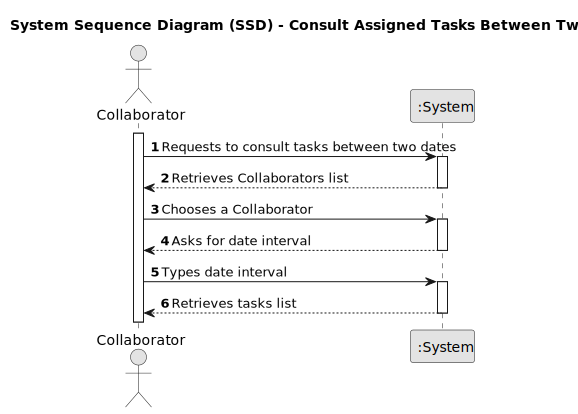

# US028 - As a Collaborator, I wish to consult the tasks assigned to me between two dates

## 1. Requirements Engineering

### 1.1. User Story Description

As a Collaborator, I need the ability to view a list of all tasks assigned to me within a specified date range.

### 1.2. Customer Specifications and Clarifications

**From the client clarifications:**

### 1.3. Acceptance Criteria

* **AC1:** The system should allow a Collaborator to consult the tasks assigned to him between two dates.
* **AC2:** The list of "green spaces" must be sorted by date.
* **AC3:** The Collaborator should be able to filter the results by the status of the task.

### 1.4. Found out Dependencies

* There is a dependency on "US21 - As a GSM, I want to add a new entry to the To-Do List" as there must be all the tasks to do.

### 1.5 Input and Output Data

**Input Data:**

* Typed data:
  * Two dates

* Selected data:
  * Collaborator
  
**Output Data:**

  * List of Collaborators
  * List of the tasks between the dates
  * (In)Success of the operation

### 1.6. System Sequence Diagram (SSD) 

**_Other alternatives might exist._**

#### Alternative One

### 1.7 Other Relevant Remarks
