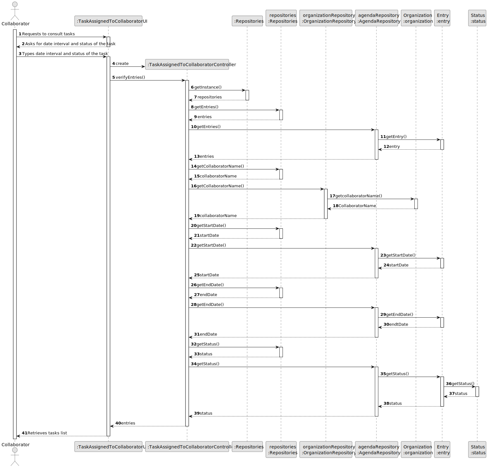
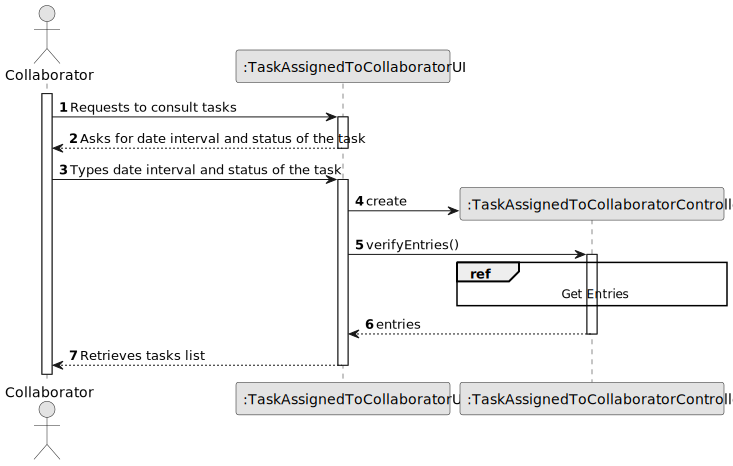
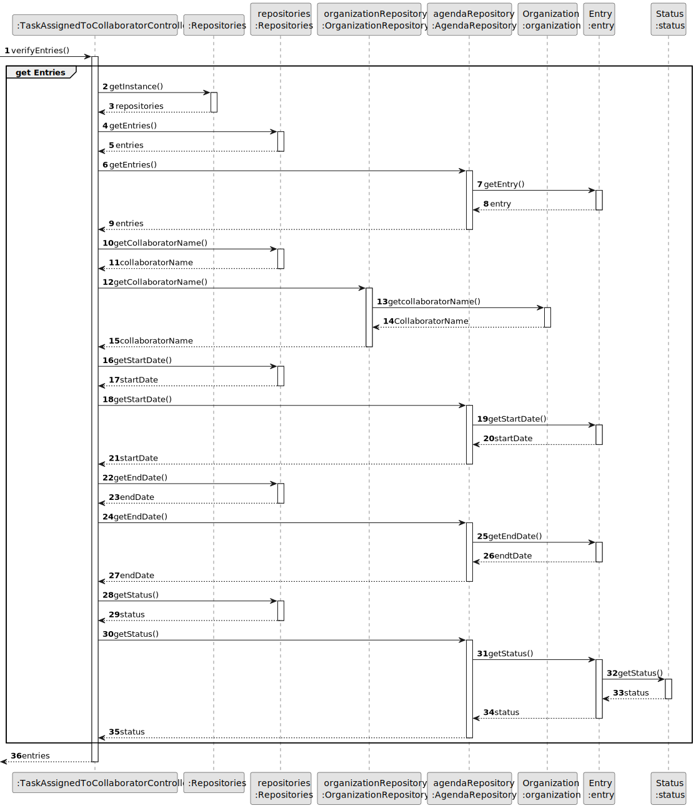
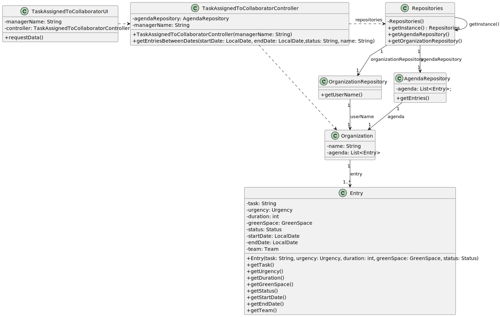

# US028 - As a Collaborator, I wish to consult the tasks assigned to me between two dates

## 3. Design - User Story Realization 

### 3.1. Rationale

_**Note that SSD - Alternative One is adopted.**_

| Interaction ID                                        | Question: Which class is responsible for...                      | Answer                               | Justification (with patterns)              |
|:------------------------------------------------------|:-----------------------------------------------------------------|:-------------------------------------|:-------------------------------------------|
| Step 1: Request to consult tasks                      | ... interacting with the actor?                                  | TaskAssignedToCollaboratorUI         | IE - is responsible for user interactions. |
|                                                       | ... coordinating the US?                                         | TaskAssignedToCollaboratorController | Controller                                 |
| Step 2: Asks for date interval and status of the task | ... obtaining the date interval and status input from the actor? | TaskAssignedToCollaboratorUI         | IE - is responsible for user interactions. |
| Step 3: Types date interval and status of the task    | ... receiving the date interval and status input?                | TaskAssignedToCollaboratorUI         | IE - is responsible for user interactions. |
|                                                       | ... creating the controller instance?                            | TaskAssignedToCollaboratorController | Controller                                 |
|                                                       | ... getting the singleton instance of repositories?              | RepositorySingleton                  | Singleton                                  |
|                                                       | ... retrieving entries from the repository?                      | Repositories                         | Information Expert                         |
|                                                       | ... fetching individual entry details?                           | AgendaRepository                     | Information Expert                         |
|                                                       | ... providing entry details?                                     | Entry                                | Information Expert                         |
|                                                       | ... obtaining the collaborator's name?                           | OrganizationRepository               | Information Expert                         |
|                                                       | ... providing the collaborator's name?                           | Organization                         | Information Expert                         |
|                                                       | ... getting the start date?                                      | AgendaRepository                     | Information Expert                         |
|                                                       | ... providing the start date?                                    | Entry                                | Information Expert                         |
|                                                       | ... getting the end date?                                        | AgendaRepository                     | Information Expert                         |
|                                                       | ... providing the end date?                                      | Entry                                | Information Expert                         |
|                                                       | ... obtaining the status?                                        | AgendaRepository                     | Information Expert                         |
|                                                       | ... fetching the status of the task?                             | Entry                                | Information Expert                         |
|                                                       | ... determining the status value?                                | Status                               | Information Expert                         |
| Step 4: Retrieves tasks list                          | ... providing the list of entries to the UI?                     | TaskAssignedToCollaboratorController | Controller                                 |
|                                                       | ... displaying the tasks list to the actor?                      | TaskAssignedToCollaboratorUI         | IE - is responsible for user interactions. |

### Systematization ##

According to the taken rationale, the conceptual classes promoted to software classes are: 

* Organization promoted to Organization
* Entry promoted to Entry

Other software classes (i.e. Pure Fabrication) identified: 

* TaskAssignedToCollaboratorUI  
* TaskAssignedToCollaboratorController
* AgendaRepository
* OrganizationRepository

## 3.2. Sequence Diagram (SD)

_**Note that SSD - Alternative Two is adopted.**_

### Full Diagram

This diagram shows the full sequence of interactions between the classes involved in the realization of this user story.

### Split Diagrams

The following diagram shows the same sequence of interactions between the classes involved in the realization of this user story, but it is split in partial diagrams to better illustrate the interactions between the classes.

It uses Interaction Occurrence (a.k.a. Interaction Use).

**Get Entries**

## 3.3. Class Diagram (CD)

