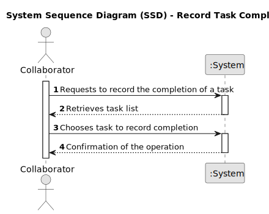

# US029 - As a Collaborator, I want to record the completion of a task

## 1. Requirements Engineering

### 1.1. User Story Description

As a Collaborator, I need the ability to record when I have completed a task.

### 1.2. Customer Specifications and Clarifications

**From the client clarifications:**

### 1.3. Acceptance Criteria

* **AC1:** The system should allow the Collaborator to record the completion of a task.
* **AC2:** The system should allow the Collaborator choose the task to record the completion.

### 1.4. Found out Dependencies

* There is a dependency on "US21 - As a GSM, I want to add a new entry to the To-Do List" as there must be all the tasks to do.

### 1.5 Input and Output Data

**Input Data:**

* Typed data:
    * Tap a key to generate a list

* Selected data:
  * Task
  
**Output Data:**
  
  * List of Tasks
  * (In)Success of the operation

### 1.6. System Sequence Diagram (SSD) 

**_Other alternatives might exist._**

#### Alternative One

### 1.7 Other Relevant Remarks
