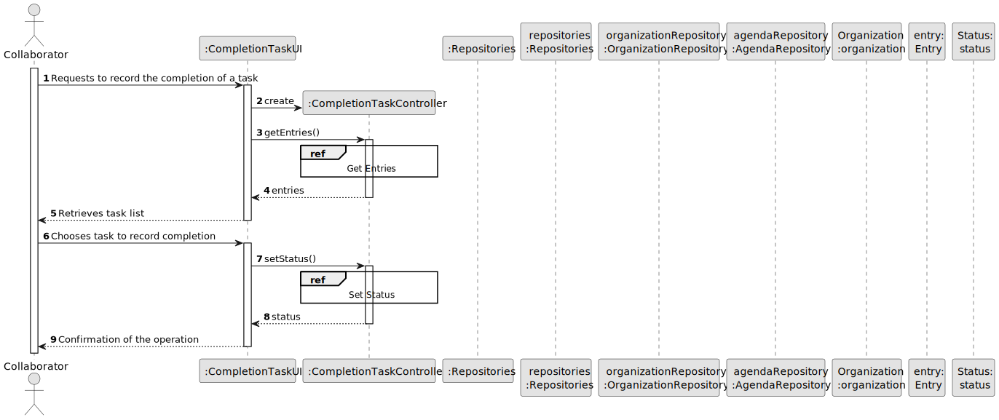

# US029 - As a Collaborator, I want to record the completion of a task

## 3. Design - User Story Realization 

### 3.1. Rationale

_**Note that SSD - Alternative One is adopted.**_

| Interaction ID                                      | Question: Which class is responsible for...         | Answer                   | Justification (with patterns)              |
|:----------------------------------------------------|:----------------------------------------------------|:-------------------------|:-------------------------------------------|
| Step 1: Requests to record the completion of a task | ... interacting with the actor?                     | CompletionTaskUI         | IE - is responsible for user interactions. |
|                                                     | ... coordinating the US?                            | CompletionTaskController | Controller                                 |
|                                                     | ... creating the controller instance?               | CompletionTaskController | Controller                                 |
|                                                     | ... getting the singleton instance of repositories? | Repositories             | Singleton                                  |
|                                                     | ... obtaining the collaborator's name?              | OrganizationRepository   | Information Expert                         |
|                                                     | ... providing the collaborator's name?              | Organization             | Information Expert                         |
|                                                     | ... retrieving entries from the repository?         | Repositories             | Information Expert                         |
|                                                     | ... fetching individual entry details?              | AgendaRepository         | Information Expert                         |
|                                                     | ... providing entry details?                        | Entry                    | Information Expert                         |
| Step 2: Retrieves task list                         | ... providing the list of entries to the UI?        | CompletionTaskController | Controller                                 |
|                                                     | ... displaying the tasks list to the actor?         | CompletionTaskUI         | IE - is responsible for user interactions. |
| Step 3: Chooses task to record completion           | ... receiving the chosen task from the actor?       | CompletionTaskUI         | IE - is responsible for user interactions. |
|                                                     | ... setting the status in the repository?           | Repositories             | Information Expert                         |
|                                                     | ... updating the status in the agenda?              | AgendaRepository         | Information Expert                         |
|                                                     | ... modifying the status of the entry?              | Entry                    | Information Expert                         |
|                                                     | ... determining the status value?                   | Status                   | Information Expert                         |
| Step 4: Confirmation of the operation               | ... confirming the status update to the UI?         | CompletionTaskController | Controller                                 |
|                                                     | ... confirming the status update to the actor?      | CompletionTaskUI         | IE - is responsible for user interactions. |

### Systematization ##

According to the taken rationale, the conceptual classes promoted to software classes are:

* Organization promoted to Organization
* Entry promoted to Entry

Other software classes (i.e. Pure Fabrication) identified:

* CompletionTaskUI
* CompletionTaskController
* AgendaRepository
* OrganizationRepository

## 3.2. Sequence Diagram (SD)

_**Note that SSD - Alternative Two is adopted.**_

### Full Diagram

This diagram shows the full sequence of interactions between the classes involved in the realization of this user story.

### Split Diagrams

The following diagram shows the same sequence of interactions between the classes involved in the realization of this user story, but it is split in partial diagrams to better illustrate the interactions between the classes.

It uses Interaction Occurrence (a.k.a. Interaction Use).

**Get Entries**

**Set Status**

## 3.3. Class Diagram (CD)

