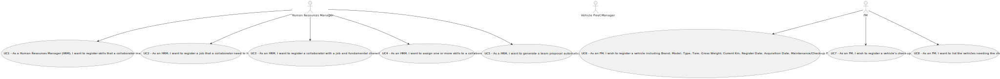

# Use Case Diagram (UCD)

**In the scope of this project, there is a direct relationship of _1 to 1_ between Use Cases (UC) and User Stories (US).**

# Use Cases / User Stories

| UC/US | Description                                                                                                                                                                                            |                   
|:------|:-------------------------------------------------------------------------------------------------------------------------------------------------------------------------------------------------------|
| US001 | [As a Human Resources Manager (HRM), I want to register skills that a collaborator may have](../../us001/Readme.md)                                                                                    |
| US002 | [As an HRM, I want to register a job that a collaborator need to have](../../us002/Readme.md)                                                                                                          |
| US003 | [As an HRM, I want to register a collaborator with a job and fundamental characteristics](../../us003/Readme.md)                                                                                       |
| US004 | [As an HRM, I want to assign one or more skills to a collaborator](../../us004/Readme.md)                                                                                                              |
| US005 | [As a HRM, I want to generate a team proposal automatically](../../us005/Readme.md)                                                                                                                    |
| US006 | [As an FM, I wish to register a vehicle including Brand, Model, Type, Tare, Gross Weight, Current Km, Register Date, Acquisition Date, Maintenance/Check-up Frequency (in Kms)](../../us006/Readme.md) |
| US007 | [ As an FM, I wish to register a vehicle’s check-up](../../us007/Readme.md)                                                                                                                            |
|US008| [As an FM, I want to list the vehicles needing the check-up](../../us008/Readme.md )                                                                                                                   |