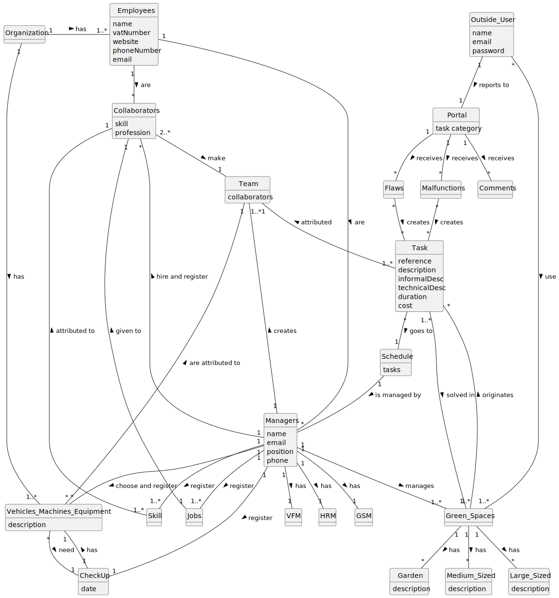

# OO Analysis

The construction process of the domain model is based on the client specifications, especially the nouns (for _concepts_) and verbs (for _relations_) used.

## Rationale to identify domain conceptual classes
To identify domain conceptual classes, start by making a list of candidate conceptual classes inspired by the list of categories suggested in the book "Applying UML and Patterns: An Introduction to Object-Oriented Analysis and Design and Iterative Development".

### _Conceptual Class Category List_

**Business Transactions**

* Task
* Schedule

---

**Transaction Line Itemss**

* Malfunctions
* Flaws
* Comments

---

**Product/Service related to a Transaction or Transaction Line Item**

* Portal

---

**Transaction Records**

* 

---  

**Roles of People or Organizations**

* Collaborators
* Managers

---

**Places**

* Green Spaces 
* Garden 
* Medium_Sized 
* Large_Sized

---

**Noteworthy Events**

* 

---

**Physical Objects**

* Vehicles_Machines_Equipment

---

**Descriptions of Things**

* 

---

**Catalogs**

* 

---

**Containers**

* 

---

**Elements of Containers**

* 

---

**Organizations**

* Organization

---

**Other External/Collaborating Systems**

* Outside_User

---

**Records of finance, work, contracts, legal matters**

* 

---

**Financial Instruments**

* 

---

**Documents mentioned/used to perform some work/**

* 

---

## Rationale to identify associations between conceptual classes

An association is a relationship between instances of objects that indicates a relevant connection and that is worth of remembering, or it is derivable from the List of Common Associations:

- **_A_** is physically or logically part of **_B_**
- **_A_** is physically or logically contained in/on **_B_**
- **_A_** is a description for **_B_**
- **_A_** known/logged/recorded/reported/captured in **_B_**
- **_A_** uses or manages or owns **_B_**
- **_A_** is related with a transaction (item) of **_B_**
- etc.

| Concept (A) 		              |  Association   	  |                 Concept (B) |
|-----------------------------|:-----------------:|----------------------------:|
| Organization                |        has        |                   Employees |
| Organization 	              |        has        | Vehicles_Machines_Equipment |
| Employees                   |        are        |               Collaborators |
| Employees                   |        are        |                    Managers |
| Managers                    |        has        |                         GSM |
| Managers                    |        has        |                         HRM |
| Managers                    |        has        |                          FM |
| Managers                    |      creates      |                        Team |
| Managers                    |      manages      |                Green_Spaces |
| Managers                    | hire and register |               Collaborators |
| Managers                    |      choose       | Vehicles_Machines_Equipment |
| Vehicles_Machines_Equipment | are attributed to |                        Team |
| Schedule                    |   is managed by   |                    Managers |
| Green_Spaces                |        has        |                      Garden |
|Green_Spaces|        has        |                Medium_Sized |
|Green_Spaces|        has        |                 Large_Sized |
|Green_Spaces|    originates     |                        Task |
|Collaborators|       make        |                        Team |
|Team|    attributed     |                        Task |
|Task|      goes to      |                        Schedule |
|Portal|     receives      |                        Malfunctions |
|Portal|     receives      |                        Flaws |
|Portal|     receives      |                        Comments |
|Outside_User|    reports to     |                        Portal |
|Outside_User|        use        |                        Green_Spaces |

## Domain Model

**Do NOT forget to identify concept atributes too.**

**Insert below the Domain Model Diagram in a SVG format**

