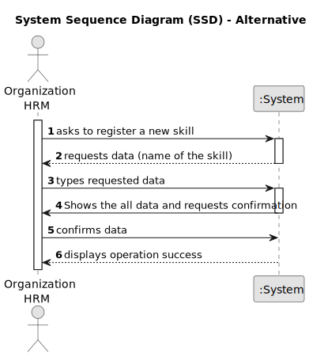

# US001 - As a Human Resources Manager (HRM), I want to register skills that a collaborator may have

## 1. Requirements Engineering

### 1.1. User Story Description

As a Human Resources Manager (HRM), who is responsible for managing human resources, teams needed on ongoing projects and defining the skills of the employees, I pretend to register skills to be given to a collaborator.

### 1.2. Customer Specifications and Clarifications 

**From the specifications document:**

>	"Thus, an employee has a main occupation (job) and a set of skills
that enable him to perform/take on certain tasks/responsibilities, for example, driving
vehicles of different types (e.g. light, or heavy), operating machines such as backhoes
or tractors; tree pruning; application of phytopharmaceuticals." Type of skills that can be added to a collaborator.
 

**From the client clarifications:**
> **Question:** "Which are the skills accepted? Or should we enable the HRM to introduce anything as a skill?"

>
> **Answer:** "All, it's up to HRM to decide. (special characters or algarisms should not be allowed in the skill name)"

> **Question:** "Should the system able the HRM to introduce multiple skills in one interaction before saving all of them?"

>
> **Answer:** "it's not required to do so."

### 1.3. Acceptance Criteria

* **AC1:** Insert a skill.
* **AC2:** The skill mustn't have special characters or digits.
* **AC3:** Only as HRM can do this action.

### 1.4. Found out Dependencies

* There is no dependencies.

### 1.5 Input and Output Data

**Input Data:**

* Typed data:
    * one skill
    * an access code
    * a confirmation/approval

**Output Data:**
  
* The registered skill
* The success (or not) of the operation

### 1.6. System Sequence Diagram (SSD)

#### Alternative One

