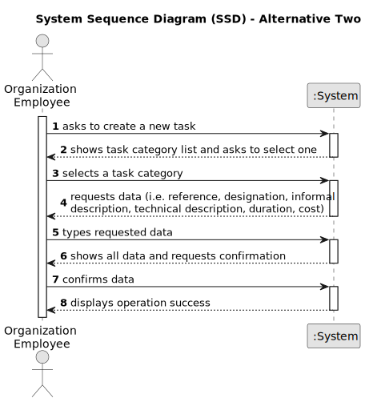

# US001 - Register skills

## 1. Requirements Engineering

### 1.1. User Story Description

As a Human Resources Manager (HRM), I pretend to register skills to be given to a collaborator.

### 1.2. Customer Specifications and Clarifications 

**From the specifications document:**

>	"Thus, an employee has a main occupation (job) and a set of skills
that enable him to perform/take on certain tasks/responsibilities, for example, driving
vehicles of different types (e.g. light, or heavy), operating machines such as backhoes
or tractors; tree pruning; application of phytopharmaceuticals." Type of skills that can be added to a collaborator.
 

**From the client clarifications:**

> **Question:** Should the system able the HRM to introduce multiple skills in one interaction before saving all of them?

>
> **Answer:** it's not required to do so.

> **Question:** Monetary data is expressed in any particular currency?
>
> **Answer:** Monetary data (e.g. estimated cost of a task) is indicated in POT (virtual currency internal to the platform).

### 1.3. Acceptance Criteria

* **AC1:** Insert a skill.
* **AC2:** The skill mustn't be already registered.
* **AC3:** Only as HRM can do this action 
* **AC4:** Must be inserted a code to confirm the operation.

### 1.4. Found out Dependencies

* There is no dependencies.

### 1.5 Input and Output Data

**Input Data:**

* Typed data:
    * one or more skills
    * an access code
    * a confirmation/approval
	
* Selected data:
    *  

**Output Data:**

* The registered skill
* The success (or not) of the operation

### 1.6. System Sequence Diagram (SSD)

**_Other alternatives might exist._**

#### Alternative One

#### Alternative Two

### 1.7 Other Relevant Remarks

* The created task stays in a "not published" state in order to distinguish from "published" tasks.