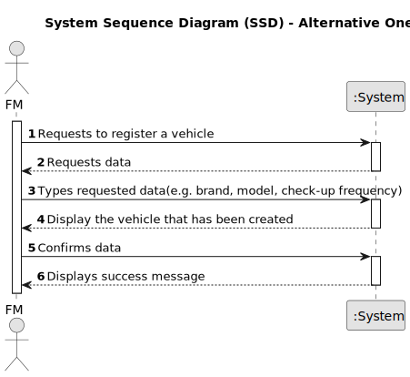

# US006 - Register a vehicle 

## 1. Requirements Engineering

### 1.1. User Story Description

As a Vehicle Park Manager (VMP) I want to register a vehicle

### 1.2. Customer Specifications and Clarifications 

**From the specifications document:**

>	"Este tipo de viatura pode ser apenas para passageiros ou misto, ligeiras ou pesadas, com ou sem caixa aberta.
Em termos de m ́aquinas, a MS possui tractores, retroescavadoras e máquinas giratórias, corta-relvas, entre outros. Os equipamentos podem ser muito diversos, como pulverizadores, plataformas elevat ́orias, motosserras, motorro ̧cadoras, sopradores, es- cadas, cisternas e alfaias diversas que podem ser acopladas aos tractores, como por exemplo: grades de discos, capinadoras, escarificadores." 

**From the client clarifications:**

> **Question:** 
>
> **Answer:** 

### 1.3. Acceptance Criteria

* **AC1:** A car must be entered
* **AC2:** The car must not already be registered.
* **AC3:** The VMP must insert a code to perform this operation as he is the only one with the power to do it.
* **AC4:** The attributes that should be used to describe a vehicle are: Make, Model, Type, Tare, Gross Weight, Current Kms, Registration Date, Acquisition Date and Overhaul Frequency (in Kms).

### 1.4. Found out Dependencies

* There is a dependency with UC07 and UC08.

### 1.5 Input and Output Data

**Input Data:**

* Typed data:
    * a reference
    * a designation 
    * an informal description
    * a technical description
    * an estimated duration
    * an estimated cost
	
* Selected data:
    * a task category 

**Output Data:**

* List of existing task categories
* (In)Success of the operation

### 1.6. System Sequence Diagram (SSD)

**_Other alternatives might exist._**

#### Alternative One

#### Alternative Two

### 1.7 Other Relevant Remarks

* The created task stays in a "not published" state in order to distinguish from "published" tasks.