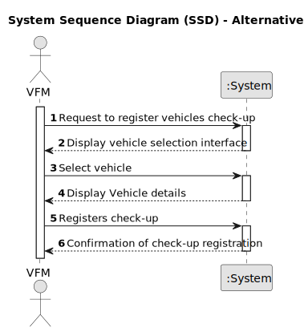

# US007 - As an FM, I wish to register a vehicle’s check-up

## 1. Requirements Engineering

### 1.1. User Story Description

As a Vehicle and Equipment Fleet Manager responsible for overseeing the maintenance and condition of 
vehicles within the organization, I need a feature that allows me to quickly register
vehicles check-up.

### 1.2. Customer Specifications and Clarifications

**From the specifications document:**

>	Vehicles are needed to carry out the tasks assigned to the teams as well as to transport machines and equipment. This type of vehicle can be only for passengers or mixed, light or heavy, open box or closed vans or trucks. As for machines, MS has tractors, backhoe loaders and rotating machines, lawn-mowers, among others. The equipment can be greatly diverse, such as sprayers, lifting platforms, chainsaws, brush cutters, blowers, ladders, cisterns and the various elements that can be attached to tractors, such as disc harrows, weeders, aerators and scarifiers.

**From the client clarifications:**

> **Question:** Which attributes will you need for the vehicle's check-up?
>
> **Answer:** Plate number, date, kms at checkup.

### 1.3. Acceptance Criteria

* **AC1:** The system should provide a feature for the Vehicle and Equipment Fleet Manager (VFM) to register a vehicle's check-up.
* **AC2:** The system should allow Vehicle and Equipment Fleet Managers to select the vehicle for which they want to register a check-up.
* **AC3:** When the Vehicle and Equipment Fleet Manager (VFM) initiates the registration process for a vehicle's check-up, the system interface should prompt the FM to provide the unique identification (ID) of the vehicle undergoing the check-up.
* **AC4:** The Vehicle and Equipment Fleet Manager should receive a confirmation message indicating successful registration of the check-up.

### 1.4. Found out Dependencies 

* There is no dependencies.

### 1.5 Input and Output Data

**Input Data:**

* Typed data:

    * Unique identification(ID) of the vehicle
    * The date of the scheduled check-up.
    * The kilometers at check-up
	
* Selected data:

    * Vehicle 

**Output Data:**

  * Vehicle information
  * (In)Success of the operation

### 1.6. System Sequence Diagram (SSD)

**_Other alternatives might exist._**

#### Alternative One

### 1.7 Other Relevant Remarks
