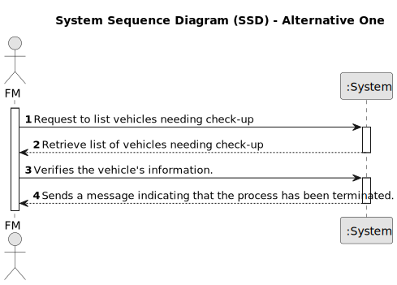

# US008 - As an FM, I want to list the vehicles needing the check-up

## 1. Requirements Engineering

### 1.1. User Story Description

As a Fleet Manager responsible for overseeing the maintenance and condition of
vehicles within the organization, I need a feature that allows me to quickly list
vehicles that require check-up.

### 1.2. Customer Specifications and Clarifications 

**From the specifications document:** FALTA ISTO

>	Each task is characterized by having a unique reference per organization, a designation, an informal and a technical description, an estimated duration and cost, as well as a task category.

>	As long as it is not published, access to the task is exclusive to the employees of the respective organization. 
 
**From the client clarifications:**

> **Question:** Can the vehicles get placed automatically on a list or the one listing has to be the FM?
>
> **Answer:** The list of vehicles is automatically created but the creation is triggered by the FM.

> **Question:** What information will appear on the final list regarding the vehicle, besides the needing for check-up?
>
> **Answer:** Data that allow to identify the vehicle like Plate, brand and model, as well as, the data that allowed to select/insert te vehicle in the list, number of kms, frequecny of checkup and the last checkup.

> **Question:** What are the criteria for the car to appear on the check-up list?
> 
> **Answer:** If it is over 95% of the mileage limit for check-up or if it has exceeded it.
### 1.3. Acceptance Criteria

* **AC1:** The system should provide a feature for the Fleet Manager (FM) to trigger the automatic creation of a list of vehicles needing a check-up based on kilometers driven.
* **AC2:** Once generated, the system should display the list of vehicles needing a check-up in a dedicated dashboard or interface accessible to the FM.
* **AC3:** The list should include relevant information for each vehicle, such as its identification number, type, kilometers driven since the last check-up, and frequency of checkup.

### 1.4. Found out Dependencies

* There is a dependency on "US006 - Vehicle Registration" as there must be all the vehicles details.

### 1.5 Input and Output Data

**Input Data:**

* Typed data:
    * Tap a key to generate a list

**Output Data:**

* List of vehicles needing a check-up
* (In)Success of the operation

### 1.6. System Sequence Diagram (SSD) 

**_Other alternatives might exist._**

#### Alternative One

### 1.7 Other Relevant Remarks

* The created task stays in a "not published" state in order to distinguish from "published" tasks.