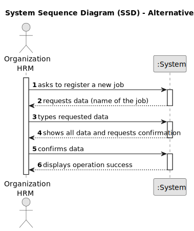

# US002 - As an HRM, I want to register a job that a collaborator need to have

## 1. Requirements Engineering

### 1.1. User Story Description

As a Human Resources Manager (HRM),who is responsible for managing human resources, teams needed on ongoing projects and defining the skills of the employees, I want to register a job.
### 1.2. Customer Specifications and Clarifications 

**From the specifications document:**

>   "Some job examples are designer, estimator, gardener, electrician or bricklayer." Different jobs that can be registered.

**From the client clarifications:**

> **Question:** "Which are the skills accepted? Or should we enable the HRM to introduce anything as a skill?"

>
> **Answer:** "All, it's up to HRM to decide. (special characters or algarisms should not be allowed in the skill name)"

### 1.3. Acceptance Criteria

* **AC1:** The system should allow the HRM to register jobs that a collaborator may have.
* **AC2:** Only as HRM can do this action.

### 1.4. Found out Dependencies

* There is no dependencies.

### 1.5 Input and Output Data

**Input Data:**

* Typed data: 
  * the name of a job
  * a confirmation/approval

**Output Data:**

* The registered job
* Confirmation of the operation
* The success (or not) of the operation

### 1.6. System Sequence Diagram (SSD)

#### Alternative One

### 1.7 Other Relevant Remarks

* As in the US001 we decided to apply the special characters and digits to all the system, so it's on FURPS+ .