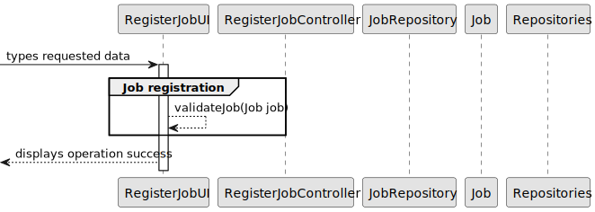

# US002 - Register a job

## 3. Design - User Story Realization 

### 3.1. Rationale

_**Note that SSD - Alternative One is adopted.**_

| Interaction ID                                 | Question: Which class is responsible for... | Answer                | Justification (with patterns)                                                                                 |
|:-----------------------------------------------|:--------------------- |:----------------------|:--------------------------------------------------------------------------------------------------------------|
| Step 1: Asks to register a new job.   		       | 	... interacting with the actor?                  | RegisterJobUI         | Pure Fabrication: there is no reason to assign this responsibility to any existing class in the Domain Model. |
| 			  		                                        | 	... coordinating the US?                         | RegisterJobController | Controller                                                                                                    |
| Step 2: Request data (name of the job) 			  		 | 	displaying the form for the actor to input data? | RegisterJobUI         | IE: is responsible for user                                                                                   |
| Step 3: Types requested data 			  		           | ... temporarily keeping the inputted data?        | RegisterJobUI         | IE: is responsible for temporarily.                                                                           |
| 			  		                                        | ...validates the data (input restrictions)        | RegisterJobUI         | IE: temporarily knows the input data                                                                          |
| 			  		                                        | ... validates the data (duplicated or not)        | JobRepository         | Information Expert: knows all jobs.                                                                                        |
| Step 4: displays operation success   		        | ... informing operation success? 			              | RegisterJobUI         | IE: is responsible for user                                                                                   | 

### Systematization ##

According to the taken rationale, the conceptual classes promoted to software classes are: 

* Job

 Other software classes (i.e. Pure Fabrication) identified:

* JobRepository
* RegisterJobUI  
* RegisterJobController

## 3.2. Sequence Diagram (SD)

_**Note that SSD - Alternative one is adopted.**_

### Full Diagram

This diagram shows the full sequence of interactions between the classes involved in the realization of this user story.

### Split Diagrams

The following diagram shows the same sequence of interactions between the classes involved in the realization of this user story, but it is split in partial diagrams to better illustrate the interactions between the classes.

It uses Interaction Occurrence (a.k.a. Interaction Use).

**Job Registration**

**Get Job Repository**

**Add Job to Repository**

## 3.3. Class Diagram (CD)

