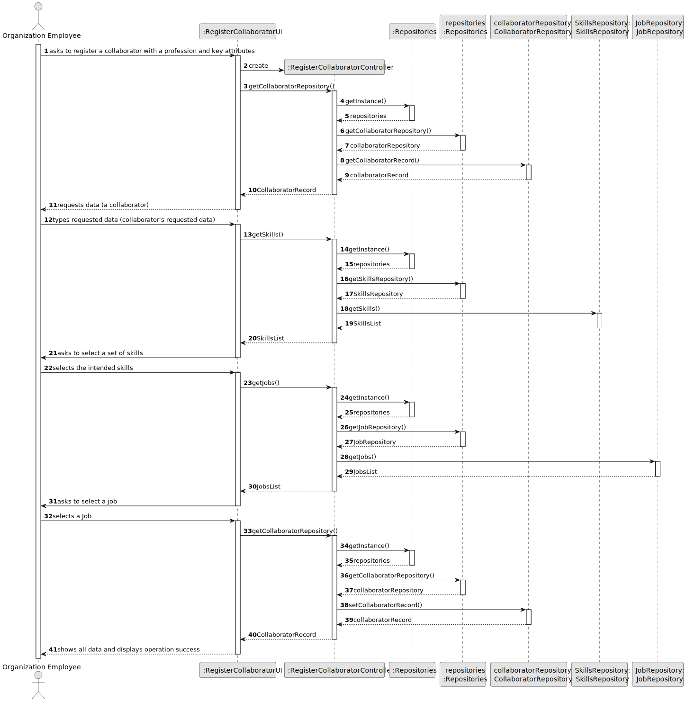
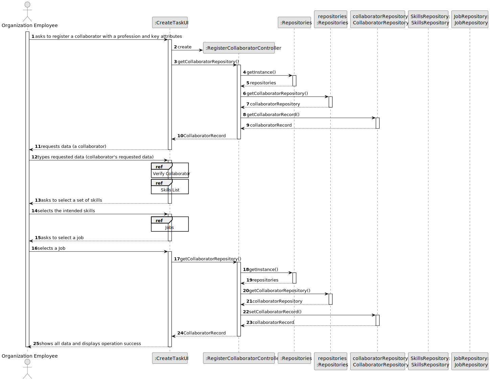
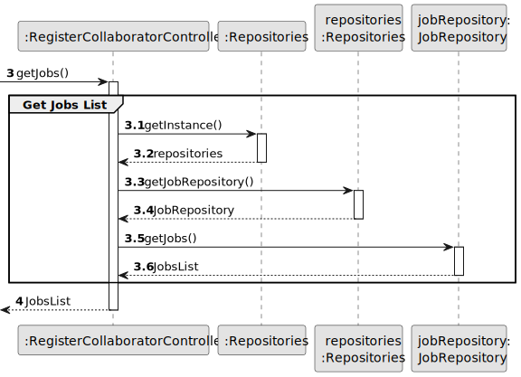
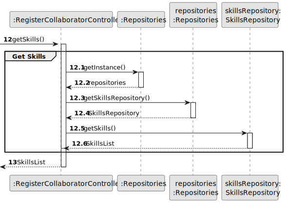
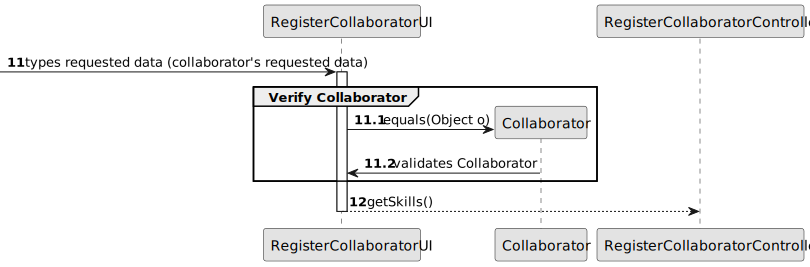
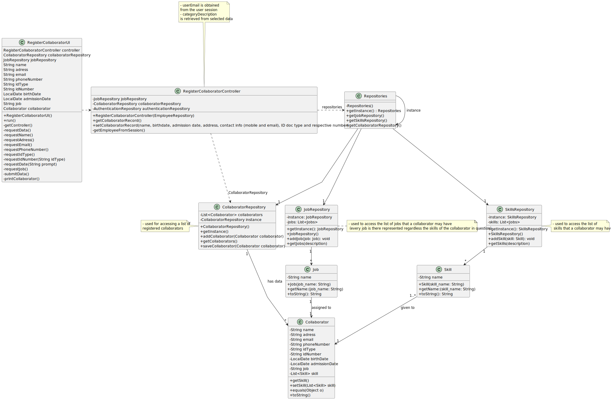

# US006 - Create a Task 

## 3. Design - User Story Realization 

### 3.1. Rationale

_**Note that SSD - Alternative One is adopted.**_

| Interaction ID | Question: Which class is responsible for...                               | Answer                                                            | Justification (with patterns)                                                                                 |
|:---------------|:--------------------------------------------------------------------------|:------------------------------------------------------------------|:--------------------------------------------------------------------------------------------------------------|
| Step 1  		     | 	... asking to register a collaborator with a profession and key attributes| RegisterCollaboratorUI                                            | Pure Fabrication: there is no reason to assign this responsibility to any existing class in the Domain Model. |
|                | 	... coordinating the US?                                                 | RegisterCollaboratorController                                    | Controller                                                                                                    |
| 			  		        | 	... instantiating a new Collaborator?                                    | RegisterCollaboratorUI                                            | Creator (Rule 1): in the DM Employees.                                                                        |
| Step 2  		     | 		... requests data (a collaborator and its pernsonal data)					          | RegisterCollaboratorUI                                            | IE: is responsible for user interactions.                                                                     |
| Step 3  		     | 	... saving the typed data?                                               | RegisterCollaboratorController                                    | IE: object created in step 1 has its own data.                                                                |
| Step 4  		     | 	... validating the inputted skills?                                      | Collaborator                                                      | Information Expert - Directly interacts with the user and validates user inputs.                              |
|                | ... asking to select a set of skills                                      | RegisterCollaboratorUI                                            | IE: object created in step 1 has one or more skills.                                                          |
| Step 5         | ... ask to select a job                                                   | RegisterCollaboratorUI                                            | IE: object created in step 1 is classified in one Job.                                                        |
| Step 6	        | 	... saving the skills and job assigned?                                  | RegisterCollaboratorController                                    | Creator - has all inputted information and is responsible for saving it.                                      |
| Step 7 		      | 			... register the new collaborator with skills and a job?				           | RegisterCollaboratorController                                    | Has all information                                                                                           |              
| Step 9  		     | 	... informing operation success?                                         | RegisterCollaboratorUI                                            | IE: is responsible for user interactions.                                                                     | 

### Systematization ##

According to the taken rationale, the conceptual classes promoted to software classes are: 

* Collaborators is promoted to Collaborator

Other software classes (i.e. Pure Fabrication) identified: 

* RegisterCollaboratorUI  
* RegisterCollaboratorController

## 3.2. Sequence Diagram (SD)

_**Note that SSD - Alternative One is adopted.**_

### Full Diagram

This diagram shows the full sequence of interactions between the classes involved in the realization of this user story.

### Split Diagrams

The following diagram shows the same sequence of interactions between the classes involved in the realization of this user story, but it is split in partial diagrams to better illustrate the interactions between the classes.

It uses Interaction Occurrence (a.k.a. Interaction Use).

**Jobs**

**Skills List**

**Verify Collaborator**

## 3.3. Class Diagram (CD)

