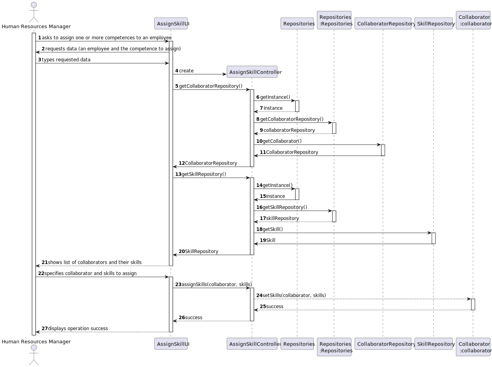
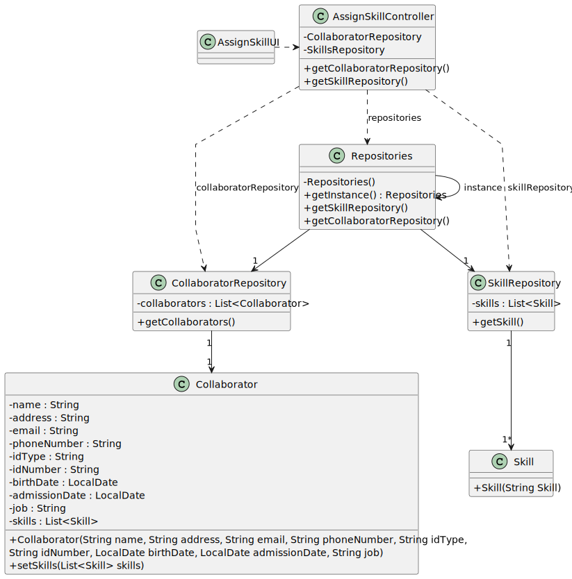

# US004 - Assign one or more skills to a collaborator 

## 3. Design - User Story Realization 

### 3.1. Rationale

_**Note that SSD - Alternative One is adopted.**_

| Interaction ID | Question: Which class is responsible for... | Answer               | Justification (with patterns)                                                                                 |
|:-------------  |:--------------------- |:---------------------|:--------------------------------------------------------------------------------------------------------------|
| Step 1: asks to skills to a collaborator.                      | ... interacting with the actor?                       | AssignSkillsUI         | Pure Fabrication: there is no reason to assign this responsibility to any existing class in the Domain Model. |
|                                                                | ... coordinating the US?                              | AssignSkillsController | Controller                                                                                                    |
| Step 2: shows list of collaborators and asks to select one.    | ... displaying the form for the actor to select data? | AssignSkillsUI         | IE: is responsible for user interactions.                                                                     |
| Step 3: selects a collaborator.                                | ... temporarily keeping the inputted data?            | AssignSkillsUI         | IE: is responsible for temporarily keeping inputted data until user confirmation.                             |
| Step 4: shows a list of skills and asks to select one or more. | ... displaying the form for the actor to select data? | AssignSkillsUI         | IE: is responsible for user interactions.                                                                     |
| Step 5: selects the skills.                                    | ... temporarily keeping the inputted data?            | AssignSkillUI          | IE: is responsible for temporarily keeping inputted data until user confirmation.                             |
| Step 6: shows all selected data and asks for confirmation.     | ... displaying all information before submitting?     | AssignSkillUI          | IE: temporarily knows inputted data until user confirmation.                                                  |
|                                                                | ... displaying the form for the actor to confirm?     | AssignSkillsUI         | IE: is responsible for user interactions.                                                                     |
| Step 7: confirms data.                                         | ... providing the selected collaborator?              | CollaboratorRepository | IE: it owns all of its collaborators                                                                          |
|                                                                | ... providing the selected skill(s)?                  | SkillRepository        | IE: it owns all of its skills.                                                                                |
|                                                                | ... assigning the skill(s) to the collaborator?       | CollaboratorRepository | IE: it is responsible for managing all of its collaborators.                                                  |
| Step 6: displays operation success.                            | ... informing operation success?                      | AssignSkillsUI         | IE: is responsible for user interactions.                                                                     |

### Systematization ##

According to the taken rationale, the conceptual classes promoted to software classes are: 

Other software classes (i.e. Pure Fabrication) identified: 

* AssignSkillsUI 
* AssignSkillsController

## 3.2. Sequence Diagram (SD)

_**Note that SSD - Alternative One is adopted.**_

### Full Diagram

This diagram shows the full sequence of interactions between the classes involved in the realization of this user story.

## 3.3. Class Diagram (CD)

