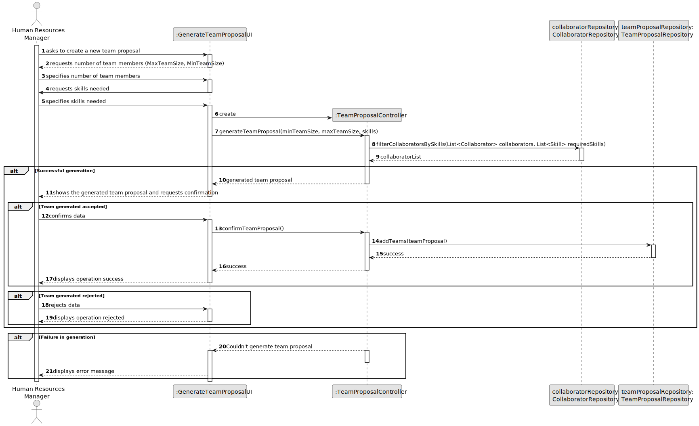
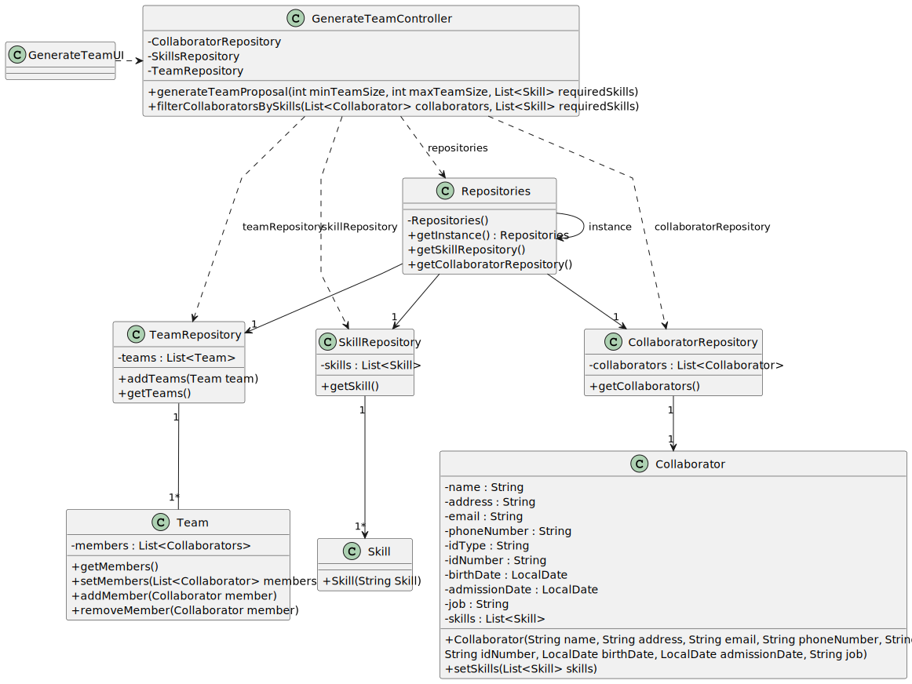

US005 - As a HRM, I want to generate a team proposal automatically

## 3. Design - User Story Realization 

### 3.1. Rationale

_**Note that SSD - Alternative One is adopted.**_

| Interaction ID                                                                | Question: Which class is responsible for...                                       | Answer               | Justification (with patterns) |
|:------------------------------------------------------------------------------|:----------------------------------------------------------------------------------|:---------------------|:------------------------------|
| Step 1 : asks to create a new team                                            | 	... interacting with the actor?                                                  | GenerateTeamUI         | Pure Fabrication              |
| 			  		                                                                       | 	... coordinating the US?                                                         | CreateTeamController | Controller                    |
| Step 2 : requests data(team name, min team size, max team size, description 	 | 	... displaying the form for the actor to input data?						                       | CreateTeamUI         | Information Expert            |
| Step 3 : types requested data.                                                | ... temporarily keeping the inputted data?                                        | GenerateTeamUI         | Information Expert            |
| Step 4 : shows skill category list and asks to select one or more  		         | 	...displaying the list of skills registered for the actor to select one or more? | GenerateTeamUI         | Information Expert            |
| Step 5 : selects one or more skill(s) 		                                      | 	... temporarily keeping the selected data?                                       | GenerateTeamUI         | Information Expert            |
| Step 6 : shows all data and requests confirmation.                            | ... displaying all information before submitting?                                 | GenerateTeamUI         | Information Expert            |    
|                                                                               | ... displaying the form for the actor to confirm?                                 | GenerateTeamUI         | Information Expert            |
| Step 7 : confirms data.                                                       | ... generate a team proposal?                                                     | GenerateTeamController | Pure Fabrication              |
| 			  		                                                                       | 	... saving the team proposal?                                                    | GenerateTeamUI         | Information Expert            | 
| Step 8 : shows team proposal and asks to confirm		                            | 	... displaying the team proposal before creates a team?                          | GenerateTeamUI         | Information Experts           | 
| Step 9 : confirms team proposal.                                              | ... instantiating a new team?                                                     | TeamRepository       | Pure Fabrication              |
|                                                                               | ... saving the team data?                                                         | Team                 | Information Expert            |
|                                                                               | ... validating the data locally (mandatory data)?                                 | Team                 | Information Expert            |
|                                                                               | ... validating the data globally (duplicate data)?                                | TeamRepository       | Information Expert            |
|                                                                               | ... saving the created team?                                                      | TeamRepository       | Information Expert            |
| Step 10 : displays operation success.                                         | ... informing operation success?                                                  | GenerateTeamUI         | Information Expert            |

### Systematization ##

According to the taken rationale, the conceptual classes promoted to software classes are: 

* Collaborators
* Team

Other software classes (i.e. Pure Fabrication) identified: 

* GenerateTeamUI
* GenerateTeamController

## 3.2. Sequence Diagram (SD)

_**Note that SSD - Alternative Two is adopted.**_

### Full Diagram

This diagram shows the full sequence of interactions between the classes involved in the realization of this user story.

## 3.3. Class Diagram (CD)

