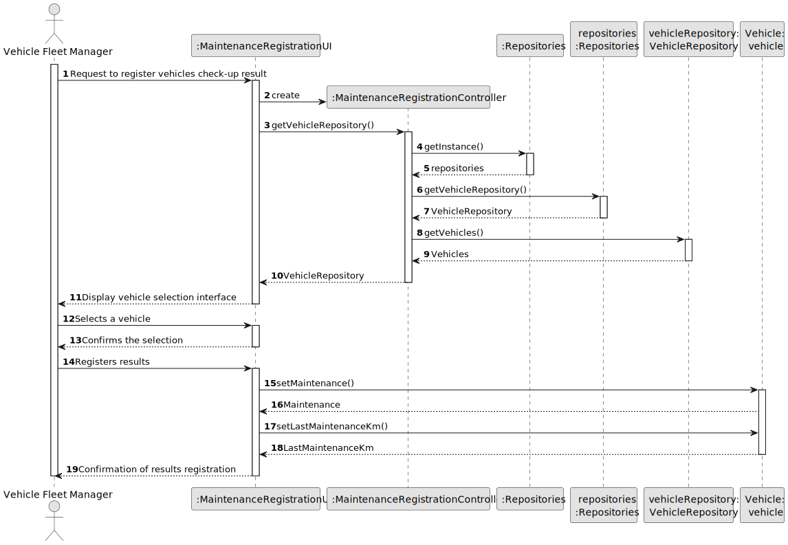
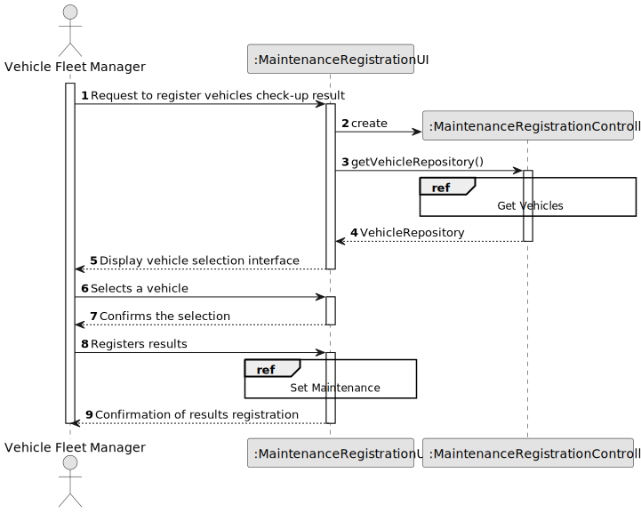
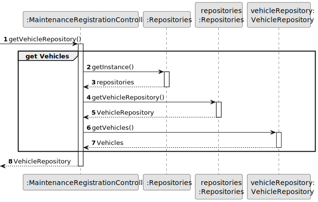
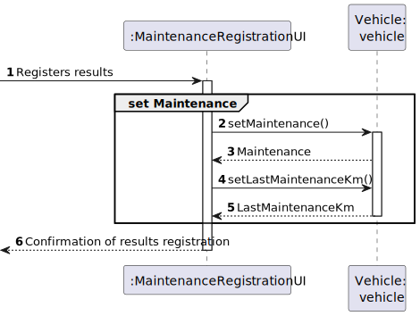
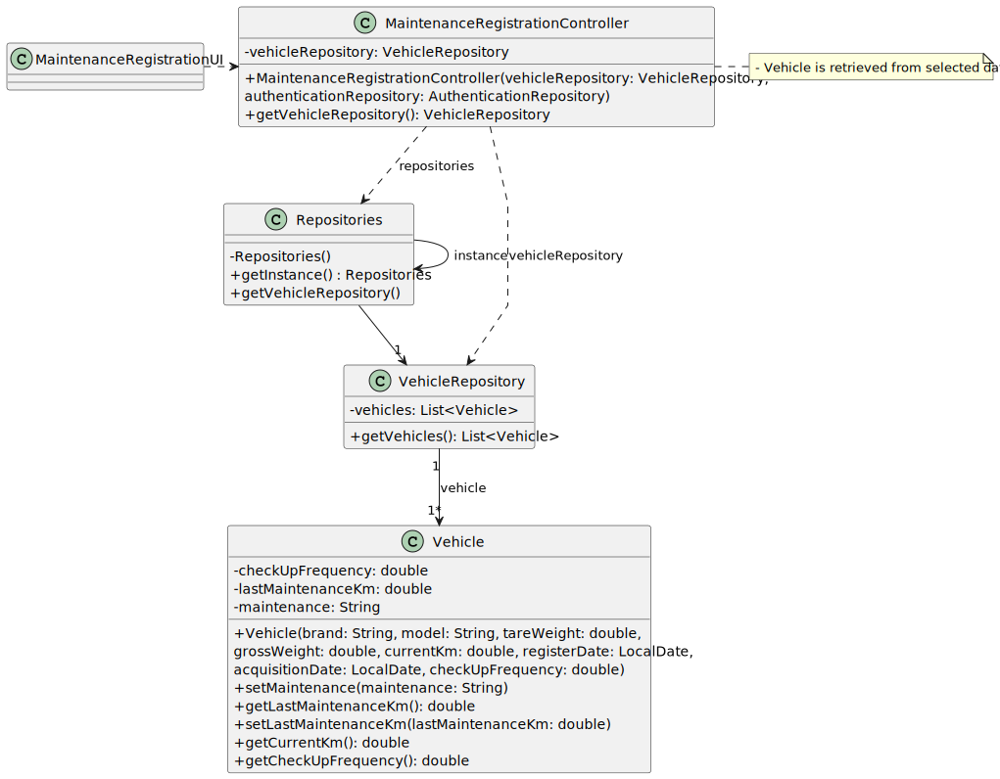

# US007 - As an FM, I wish to register a vehicle’s check-up

## 3. Design - User Story Realization 

### 3.1. Rationale

_**Note that SSD - Alternative One is adopted.**_

| Interaction ID                                       | Question: Which class is responsible for...           | Answer                            | Justification (with patterns)                                                                           |
|:-----------------------------------------------------|:------------------------------------------------------|:----------------------------------|:--------------------------------------------------------------------------------------------------------|
| Step 1: Request to register vehicles check-up result | ... interacting with the actor?                       | MaintenanceRegistrationUI         | Pure Fabrication                                                                                        |
|                                                      | ... coordinating the US?                              | MaintenanceRegistrationController | Controller - Orchestrates the use case, coordinating actions between UI and other parts of the system.  |
| Step 2: Display vehicle selection interface          | ... providing the Vehicles needing check-up list?     | VehicleRepository                 | Creator - Manages vehicle data and is responsible for providing the list of vehicles needing check-ups. |
|                                                      | ... displaying the form containing the list of jobs?  | MaintenanceRegistrationUI         | IE - is responsible for user interactions.                                                              |
| Step 3: Selects a vehicle                            | ... temporarily keeping the inputted data?            | MaintenanceRegistrationUI         | Information Expert - Holds user inputs temporarily until further processing.                            |
| Step 4: Confirms the selection                       | ... displaying all information before submitting?     | MaintenanceRegistrationUI         | IE - is responsible for user interactions.                                                              |
| Step 5: Registers results                            | ... validating the data?                              | MaintenanceRegistrationUI         | Information Expert - Directly interacts with the user and validates user inputs.                        |
|                                                      | ... instantiating a new check-up result?              | Vehicle                           | Creator - Responsible for creating new instances of check-up results.                                   |
|                                                      | ... saving the inputted data?                         | Vehicle                           | Creator - Has information about check-up results and is responsible for saving them.                    |
| Step 6: Confirmation of results registration         | ... informing operation success?                      | MaintenanceRegistrationUI         | IE - is responsible for user interactions.                                                              |

### Systematization ##

According to the taken rationale, the conceptual classes promoted to software classes are: 

* Vehicles_Machines_Equipment promoted to Vehicle

Other software classes (i.e. Pure Fabrication) identified: 

* MaintenanceRegistrationUI  
* MaintenanceRegistrationController

## 3.2. Sequence Diagram (SD)

### Full Diagram

This diagram shows the full sequence of interactions between the classes involved in the realization of this user story.

### Split Diagrams

The following diagram shows the same sequence of interactions between the classes involved in the realization of this user story, but it is split in partial diagrams to better illustrate the interactions between the classes.

It uses Interaction Occurrence (a.k.a. Interaction Use).

**Get Vehicles**

**Set Maintenance**

## 3.3. Class Diagram (CD)

