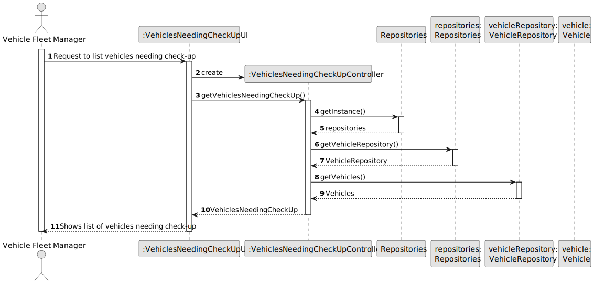
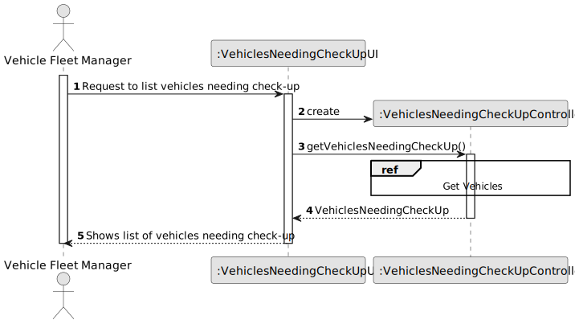
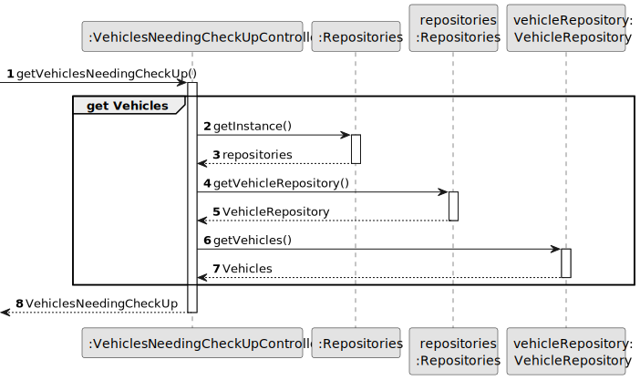
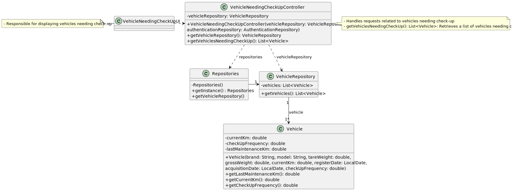

# US008 - As an FM, I want to list the vehicles needing the check-up

## 3. Design - User Story Realization 

### 3.1. Rationale

_**Note that SSD - Alternative One is adopted.**_

| Interaction ID                                       | Question: Which class is responsible for...                | Answer                              | Justification (with patterns)               |
|:-----------------------------------------------------|:-----------------------------------------------------------|:------------------------------------|:--------------------------------------------|
| Step 1: Request to list vehicles needing check-up    | ... interacting with the actor?                            | VehicleNeedingCheckUpUI             | IE - is responsible for user interactions.  |
|                                                      | ... coordinating the US?                                   | VehicleNeedingCheckUpController     | Controller                                  |
| Step 2: Shows list of vehicles needing check-up      | ... generating the list of vehicles in need of a check-up? | VehicleRepository                   | Information Expert                          |
|                                                      | ... providing Check-Up information of a vehicle?           | Vehicle                             | Information Expert                          |
|                                                      | ... providing the list to the actor?                       | VehicleNeedingCheckUpUI             | IE - is responsible for user interactions.  |

### Systematization ##

According to the taken rationale, the conceptual classes promoted to software classes are: 

* Vehicles_Machines_Equipment promoted to Vehicle

Other software classes (i.e. Pure Fabrication) identified: 

* VehicleNeedingCheckUpUI  
* VehicleNeedingCheckUpController

## 3.2. Sequence Diagram (SD)

_**Note that SSD - Alternative Two is adopted.**_

### Full Diagram

This diagram shows the full sequence of interactions between the classes involved in the realization of this user story.

### Split Diagrams

The following diagram shows the same sequence of interactions between the classes involved in the realization of this user story, but it is split in partial diagrams to better illustrate the interactions between the classes.

It uses Interaction Occurrence (a.k.a. Interaction Use).

**Get Vehicles**

## 3.3. Class Diagram (CD)

